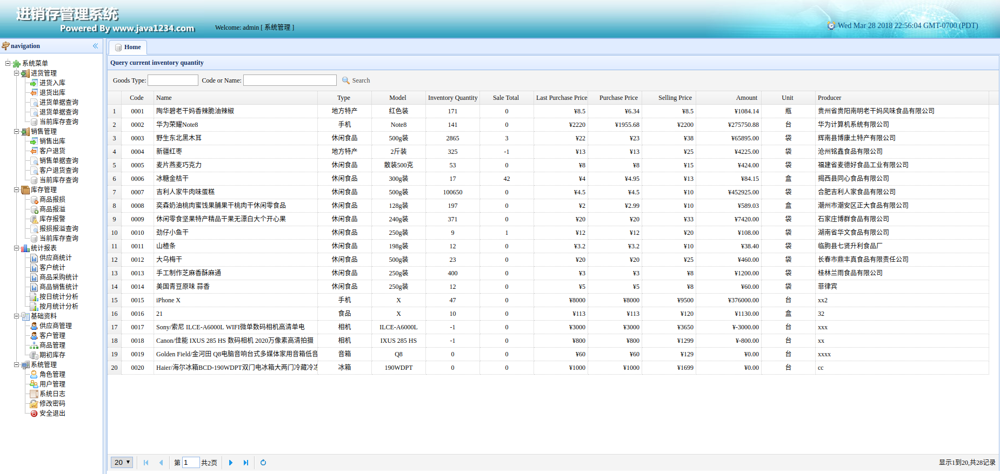
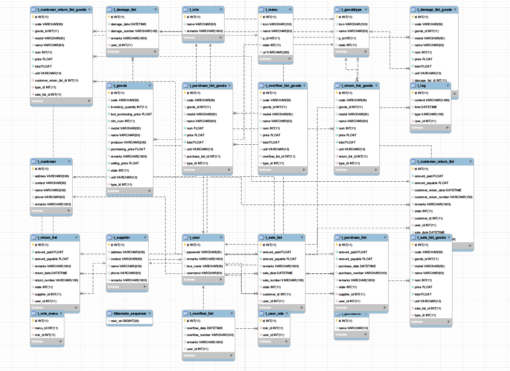

# Invoicing Management

This is Spring Boot based invoicing management system. The main technologies are Spring Boot, Shiro, MySQL, EasyUI. 
It includes administration system, basic information system, purchase system, sale system, inventory system and statistics system.

Here is a example of its UI as shown below. A operator need to login in with its role, different roles have different authorities.
The administer could hand users and roles. The log module responses to record all operations in this system.

For a inventory, it has the function purchase, sale and monitoring. The basic function of this inventory is purchasing goods
 from suppliers, storing them and selling them to customers. So we need a system to check, add, edit the basic information
 such as suppliers, customers and goods. 
 
For purchasing process, users can purchase goods with a purchase list with some purchase list goods and check the purchase lists.
on the contrary, users can also return goods with a return list with some return list goods and check the purchase lists.

And the process of selling is similar to purchasing.

For monitoring, this system should have the ability to show the goods which are damaged, overflowed, or the inventory quantity is too low.

For statistics, it can show some information about suppliers, customers, purchasing, selling, etc. 

All tables and their relationship as shown below. The tables are designed and built based on module function with one list and their goods,
for instance, purchase_list and purchase_list_goods. Except that, we have some basic tables such as user, role, menu, goods, log. 

 
